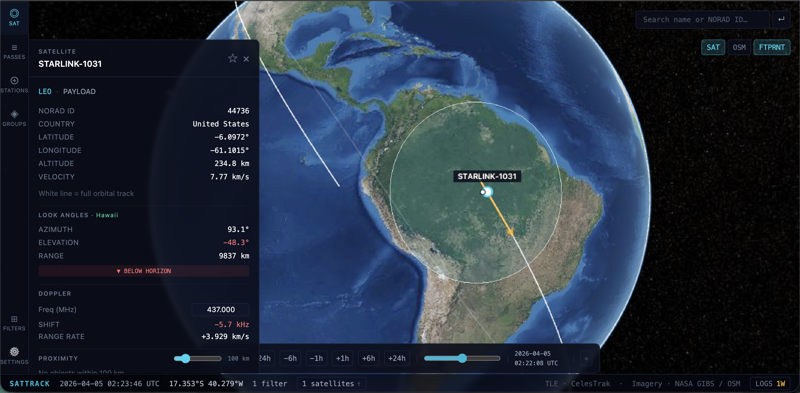

# SatTrack

Real-time satellite tracking in the browser. Visualizes the entire active catalog (~10,000+ objects) on an interactive 3D globe with pass predictions for user-defined ground stations.



## Features

- 3D globe with live satellite positions (SGP4 propagation via Web Worker)
- Filter by orbit class, object type, country, inclination, RCS size, mission purpose, and more
- Ground station management with AOS/TCA/LOS pass predictions
- Constellation groups with color-coded overlays
- Sim clock — scrub time forward/backward to preview future passes
- Gantt-style pass schedule with elevation quality indicators

## Getting Started

**Prerequisites:** Node.js 18+

```bash
git clone https://github.com/finnerr/SatTrack.git
cd SatTrack
npm install
npm run dev
```

Open http://localhost:5173.

The repo ships with a bundled TLE snapshot so the app works offline out of the box. To pull a fresh catalog from CelesTrak:

```bash
npm run fetch-tles
```

## Keyboard Shortcuts

| Key | Action |
|-----|--------|
| `/` | Focus search |
| `S` | Toggle satellite list |
| `L` | Toggle log panel |
| `Escape` | Deselect satellite |
| `Cmd/Ctrl + Backspace` | Return to live time |

## Tech Stack

- [Vite](https://vitejs.dev) + [React](https://react.dev) + TypeScript
- [CesiumJS](https://cesium.com) via [resium](https://resium.reearth.io)
- [Zustand](https://zustand-demo.pmnd.rs) for state
- [Tailwind CSS](https://tailwindcss.com)
- [satellite.js](https://github.com/shashwatak/satellite-js) for SGP4 propagation
- TLE data from [CelesTrak](https://celestrak.org)
